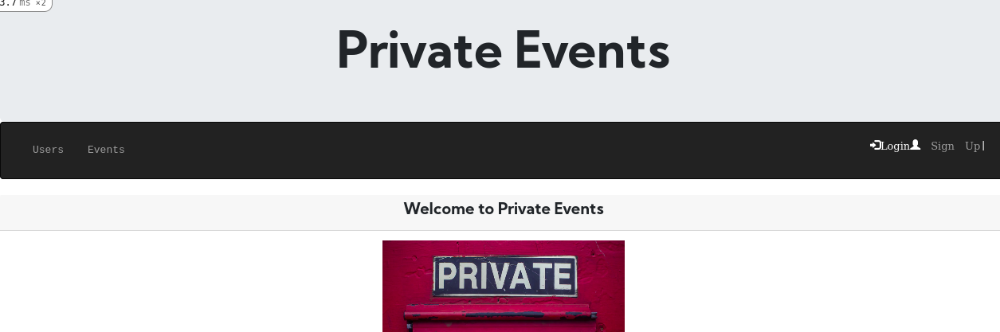
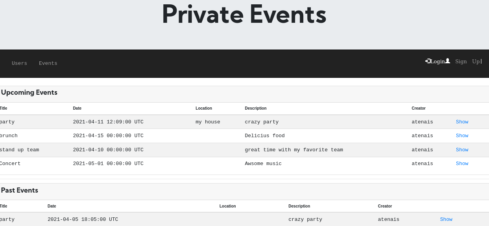
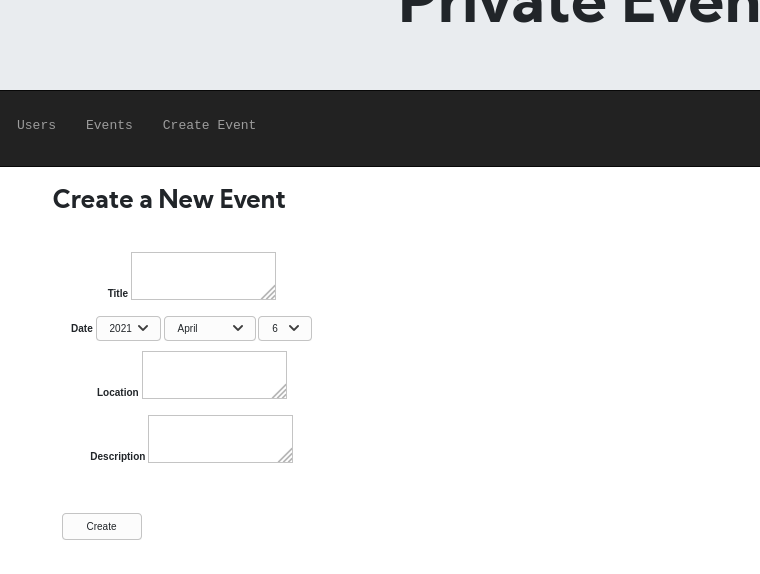

# Private Events (Rails Associations)

> We built a site similar to a private [Eventbrite](https://www.eventbrite.com/) which allows users to create events and then manage user signups. Users can create events and sign to attendee an event. Events take place at a specific date and at a location.

> A user can create events. A user can attend many events. An event can be attended by many users

> The main goal is to demonstrate mastering in building Rails Associations

## Features

If you're not an authenticated user

- Create User
- Log in

If you are an authenticated user

- See the list of Events available divided by upcoming and previous events
- See users attendance list
- See the attendance list for a specific event
- Register to attend an event

## Built With

- ruby '2.7.1'
- 'rails', '~> 6.0.3', '>= 6.0.3.2'
- 'sqlite3', '~> 1.4'
- Rspec gem
- Simple_form gem

## Getting Started

​To have a version on your local machine:

- Clone repository repository with this command on terminal

- Open a terminal on the containing folder of this project
- Run 
  * 'bundle install' to install the dependencies
- Set the database using the command
  * 'bin/rake db:migrate'
- Run the server using the command 
  * 'rails server'

- Access http://localhost:3000/ in your browser

- Use the links, forms and buttons to explore the features and create objects in our database

## RSpec Testing

This repo contains files to test the validations and associations on models.
You can run the following command on your terminal to run the tests.

> - rspec

or customize them changing the files inside the spec folder.

## Authors

👤 **Atenais Campos**

- Github: [@atenaiis](https://github.com/atenaiis)
- Twitter: [@spranomarian](https://twitter.com/SopranoMarian)
- Linkedin: [linkedin](https://www.linkedin.com/in/mariana-atenai-campos-garcia-a30791143/)

## 🤝 Contributing

Contributions, issues and feature requests are welcome!

## Show your support

Give a ⭐️ if you like this project!

## Acknowledgments

- Hat tip to anyone whose code was used
- Inspiration
- etc
